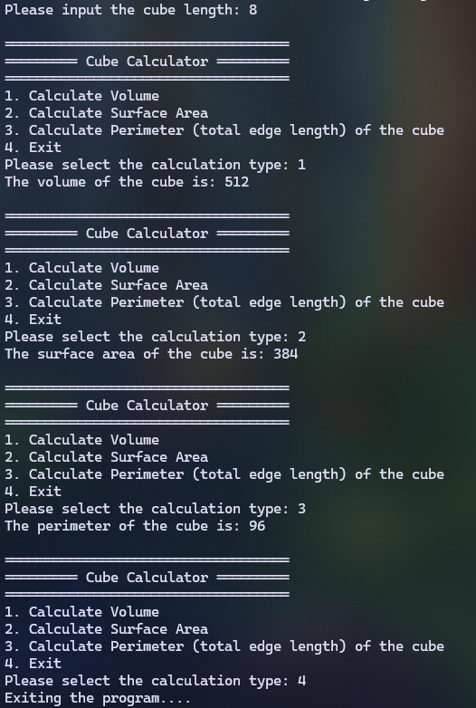
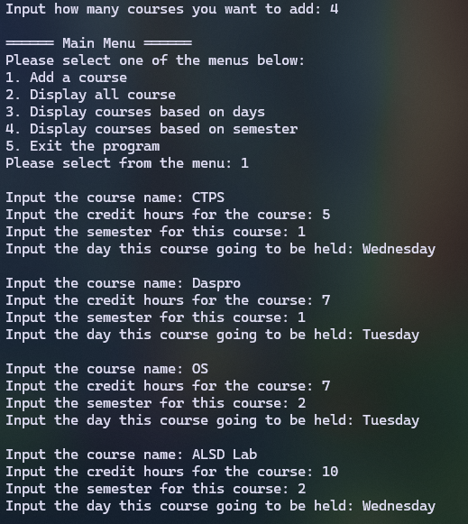
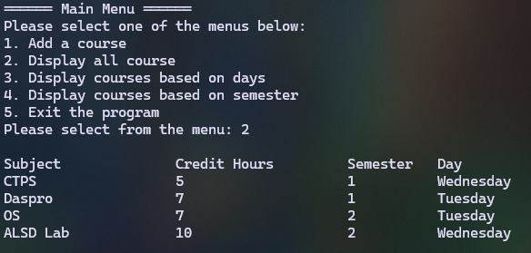
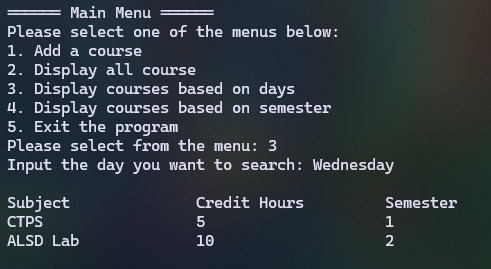
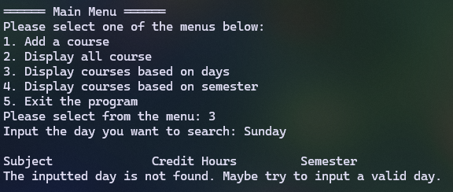
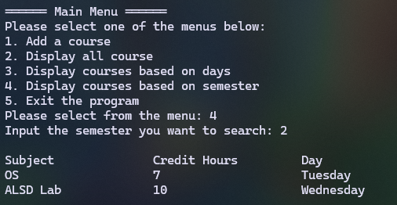
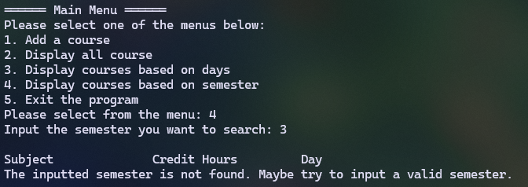
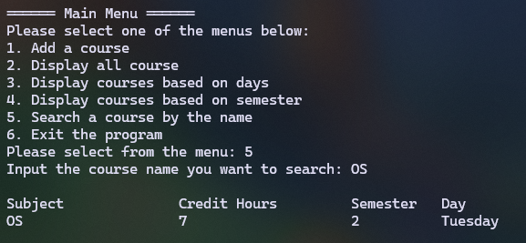
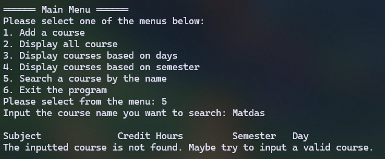

|  | Algorithm and Data Structure |
|--|--|
| NIM |  244107020215|
| Nama |  Herconary Angga |
| Kelas | TI - 1I |
| Repository | [link] (https://github.com/ukakooo/2ndSemester-PraktALSD/tree/main/1.%20Jobsheet%201%20(Basic%20Programming%20Review)) |

# Labs #1 Programming Fundamentals Review

## 2.1.1. Selection Solution

The solution is implemented in Selection.java, and below is screenshot of the result.

**Brief explanaton:** There are 4 main step: 
1. Input all grades
2. Validate the input (If Invalid, repeat the process until we get the input right)
3. Calculate and convert the final grade
4. Decide the final status and show the statistics of the results

## 2.2.1. Looping Solution

The solution is implemented in Looping.java, and below is screenshot of the result.

**Brief explanaton:** There are 7 main step: 
1. Input NIM
2. Use modulo operator to get the last two digits of the NIM (n)
3. Validate whether the two digits are less than 10 or no (if less than 10, then sum the two digits to 10)
4. Use a loop process to display the numbers until it reached the last two digits of the NIM (n)
5. Check every loop whether the number is either 6 or 10. If it's 6 or 10, print a blank String/skip the number.
6. Check if there's a 0 number in there. If there is, skip the 0 number
7. Checks if the number is even or no. If it's an even number, prints the actual number. If it's an odd number, prints an arterisk.

## 2.3.1. Array Solution

The solution is implemented in Array.java, and below is screenshot of the result.

**Brief explanaton:** There are 4 main step: 
1. Input each Grade for each subject
2. Convert each Grade on each subject into "Nilai Setara" and Letter Grade
3. Calculate the IP by totaling the whole "Nilai Setara" and divide it by the length of the courses
4. Display each Numeric Grades, Letter Grades, Bobot Nilai/Nilai Setara for each subject and the overall IP

## 2.4.1. Function Solution

The solution is implemented in Selection.java, and below is screenshot of the result.

**Brief explanaton:** There are 6 main step: 
1. Display Main Menu
2. Input the choices
3. If choice 1 was choosen, calculate the total income for each branch and then display the list of each stock, the total income and the prices for each flower type
4. If choice 2 was choosen, display the stocks for the 4th branch
5. Decrease the amount of the stocks with the dead flowers
6. Display the result of that calculation

## 3. Assignment 1 Solution

The solution is implemented in Assignment1.java, and below is screenshot of the result.

**Brief explanaton:** There are 4 main step: 
1. Input the Code
2. Check whether the inputted code matches the code in the cityCode[] Array
3. If not, loops the process until the input is valid
4. If matches, display the city name based on the code

## 3. Assignment 2 Solution

The solution is implemented in Assignment2.java, and below is screenshot of the result.

**Brief explanaton:** There are 4 main step: 
1. Input the Length
2. Input the calculation type
3. If 1 is choosen, calculate the Volume
4. If 2 is choose, calculate the surface area
5. If 3 is choosen, calculate the perimeter of the cube
4. If 4 is choosen, leave the program

## 3. Assignment 3 Solution

The solution is implemented in Assignment3.java, and below is screenshot of the result.

**Brief explanaton:** There are 8 main step: 
1. Input the number (n) of courses to input
2. Input the the given choices
3. If 1 is inputted as a choice, input each category of courses (e.g. Name, Credit Hours, Semesters, Days) the amount of n times
4. If 2 is inputted as a choice, display all courses that was inputted
5. If 3 is inputted as a choice, input the day the user wants to search. And then display the courses that is scheduled on the inputted day
6. If 4 is inputted as a choice, input the semester the user wants to search. And then display the courses that is on the inputted semester
7. If 5 is inputted as a choice, input the course name the user wants to search. And then display the course that was inputted
8. If 6 is inputted as a choice, exits the program