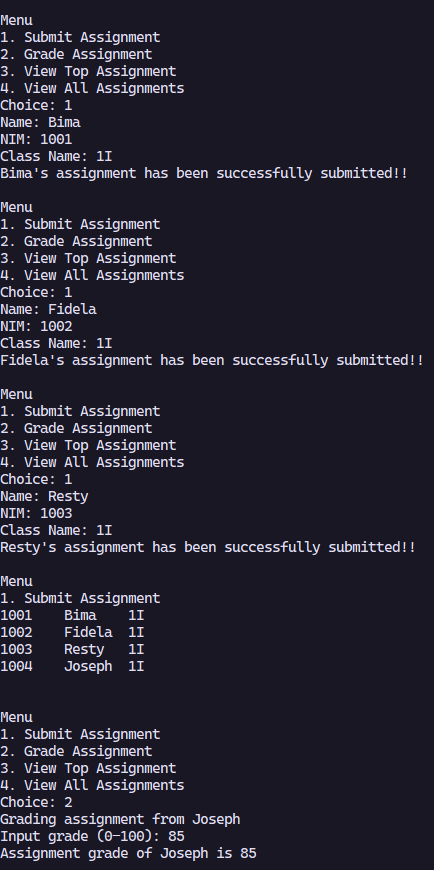
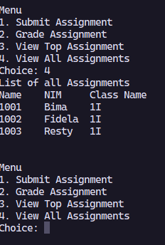
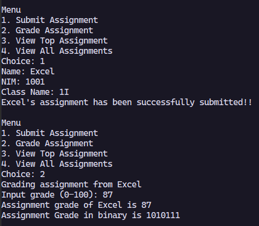
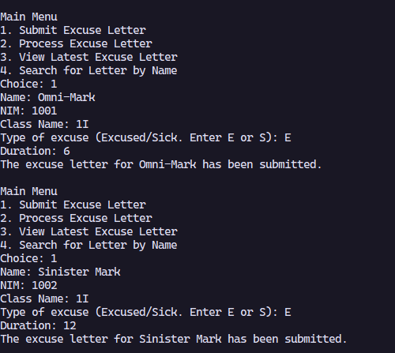
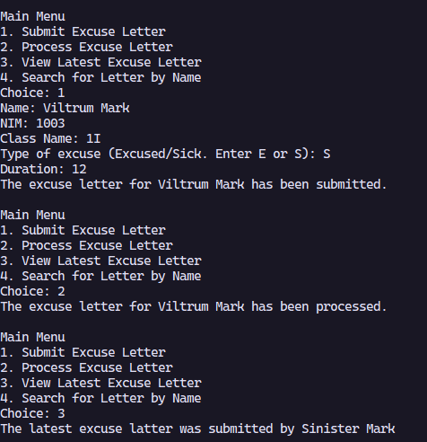
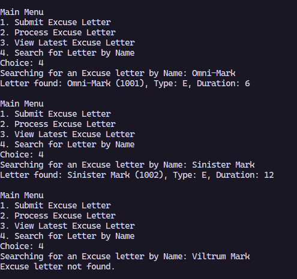

|  | Algorithm and Data Structure |
|--|--|
| NIM |  244107020215|
| Nama |  Herconary Angga |
| Kelas | TI - 1I |
| Repository | [link] (https://github.com/ukakooo/2ndSemester-PraktALSD) |

# Labs #10 Stack

## Experiment 2.1: Student Assignment Stack

The solution is implemented in the Exp1 Folder, and below is screenshot of the result.

## Brief Explanation
1. Make a Student16 class to store students's datas
2. Make a StudentAssignmentStack16 Class to store the stack of the student
3. Declare object from the Stack class and declare a scanner
4. Print a main menu for the user to choose
5. 1st choice: Prompt the user to input students's data into the stack and then save the datas into the stack
6. 2nd choice: 
- use the pop method from the stack object
- input the latest student's grade
- print the grade of the latest student that was inputted
7. 3rd choice: use the peek method to print who is the latest student to submit the assignment
8. 4th choice:  Prints the whole stack

### Questions
1. Stack reflects the real-life scenario of grading assignments where the last submitted is graded first.

2. 
   - `push()` adds a `Student` to the stack (on submission).
   - `pop()` grades, then removes and returns the latest student from the stack (on grading).

3. Prevents exceeding array bounds. Without the check, it can throw an `ArrayIndexOutOfBoundsException`.

4. 5 assignments, as defined in `new StudentAssignmentStack(5);`

5. Added `getBottom()` method in `StudentAssignmentStack16` and returns it the stack in the zero index `stack[0]`

6. Use top attribute and add by 1 to count

7. How to implement stacks into programs such as Push, Pop, etc. Converting Decimal to Binary

## Experiment 2.2: Convert Assignment Grade to Binary

The solution is implemented in the Exp2 Folder, and below is screenshot of the result.

## Brief Explanation
1. Make another class named the ConversionStack to store the result of the modular to convert to binary
2. Implement the convert to binary method in the student's stack's class by:
- Declare the conversion stack object
- loop to calculate the modulus of the grade variable (this is the binary digit)
- use the push method from the conversion stack
- divide the grade variable by 2 (end of loop)
- Pop all digits from the stack and append them to a String to form the binary number in correct order.
- Return the binary string.
3. Print the result of the binary string in the 2nd choice of the menu

### Questions
1. Uses a temporary stack to store mod 2 results of the grade. Pops all to reverse order and get the binary form of the grade.
2. It works the same way as `grade > 0` because the conditions checks whether grade is not 0.

## Assignment

The solution is implemented in the Assignment Folder, and below is screenshot of the result.

