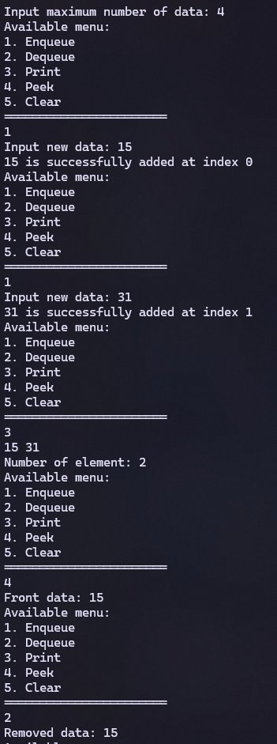
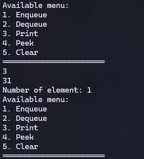

|  | Algorithm and Data Structure |
|--|--|
| NIM |  244107020215|
| Nama |  Herconary Angga |
| Kelas | TI - 1I |
| Repository | [link] (https://github.com/ukakooo/2ndSemester-PraktALSD) |

# Labs #11 Queue

## 2.1.1. Queue Basic Operations

The solution is implemented in Exp1 Folder, and below is screenshot of the result.

**Brief explanaton:**  
1. Input all grades
2. Validate the input
3. Calculate and convert the final grade
4. Decide the final status

## Questions:
1. To indicate that the queue is empty
2. 

## 2.1.1. Selection Solution
Continue to report the result....