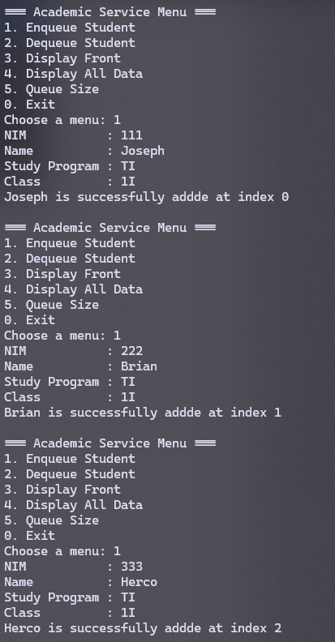
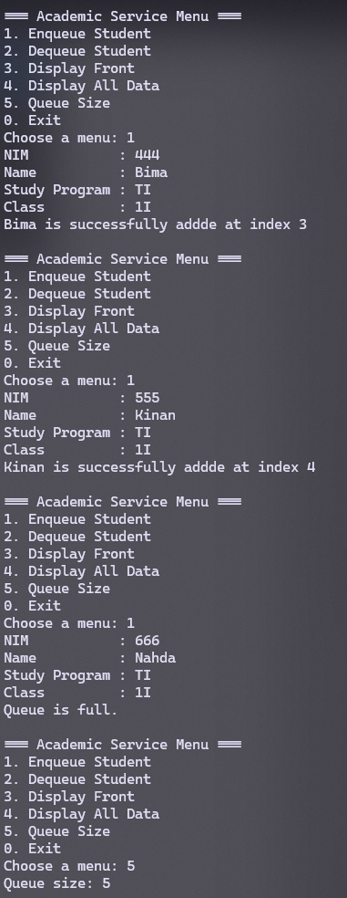
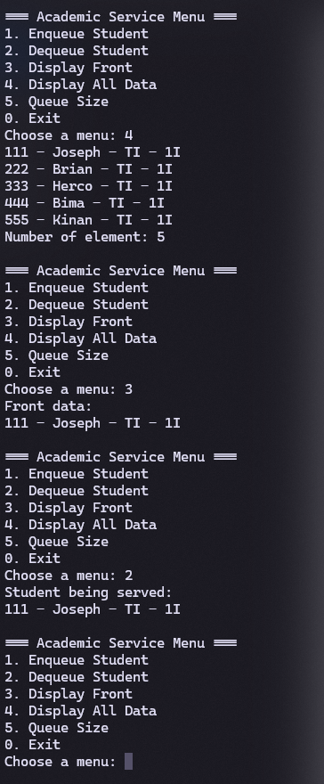
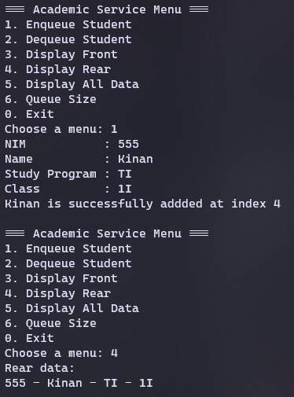

|  | Algorithm and Data Structure |
|--|--|
| NIM |  244107020215|
| Nama |  Herconary Angga |
| Kelas | TI - 1I |
| Repository | [link] (https://github.com/ukakooo/2ndSemester-PraktALSD) |

# Labs #11 Queue

## 2.1. Queue Basic Operations

The solution is implemented in Exp1 Folder, and below is screenshot of the result.


**Brief explanaton:**  
1. Make a queue class to store the queue of the data
2. In main class, create a menu method
3. In the main class and in the main method, declare a scanner
4. Prompt the user to input the maximum number of the data
5. Instantiate the queue object with the maximum number that was prompted
6. Use the menu method
7. after the user choose a menu:
- 1st choice: Prompt the user to input the data, then use the enqueue method in the queue object
- 2nd choice: Use the dequeue method in the queue object and prints the removed data
- 3rd choice: Prints all data using the print() method in the queue object
- 4th choice: Prints the front index of the queue using the peek() method in the queue object
- 5th choice: Clear the whole queue using the clear method in the queue object
- Other than the given choice: exits the program

## Questions:
1. In the constructor, why are the initial values of the `front` and `rear` attributes set to -1, while the `size` attribute is set to 0?  
    To indicate that the queue is empty
2. In the Enqueue method, explain the meaning and purpose of the following code snippet:
```
if (rear == max - 1) {
    rear = 0;
}
```
    Checks whether the `rear` is already reached the last index. Then resets the `rear` position back to 0 if the condition's met
3. In the Dequeue method, explain the meaning and purpose of the following code snippet:
```
if (front == max - 1) {
    front = 0;
}
```
    Checks whether the `front` is already reached the last index. Then resets the `front` position back to 0 if the condition's met
4. In the `print` method, why does the loop variable `i` start from `front` instead of 0 (i.e., `int i = 0`)?  
    Because the `front` of the queue might not be at index 0 and also to ensure the elements are printed in the FIFO order (First in, first out)
5. Review the `print` method again, and explain the meaning of the following code snippet: `i = (i + 1) % max;`  
    Moves to the next index. But if the loop reached the end of the index (which is max), resets the index to the first index (0)
6. Show the code snippet that represents a queue overflow!
```
if (isFull()) {
    System.out.println("Queue is full!!!");
}
```
7. When a queue overflow or underflow occurs, the program continues to run and only displays informational text. Modify the program so that it stops when a queue overflow or underflow happens!


## 2.2. Academic Service Queue

The solution is implemented in Exp2 Folder, and below is screenshot of the result.





**Brief explanaton:**  
1. Make a Student's class to store student's datas
2. Make a queue class to store the queue of the data
3. In the main class and in the main method, declare a scanner
4. Instantiate the queue object with the maximum number that was prompted
5. after the user choose a menu:
- 1st choice: Prompt the user to input the data, then use the `enqueue method in the queue object
- 2nd choice: Use the `dequeue` method in the queue object and prints the removed Student
- 3rd choice: Prints the front data
- 4th choice: Prints all the data using the `print()` method in the object
- 5th choice: prints the queue size
- Other than the given choice: exits the program

## Questions:
1. What is the main difference between the `Queue` (Experiment 1) and `StudentQueue` classes in terms of the data type they manage? Why is this change in data type important?
    - In the 1st Experiment, the queue uses int datatype to store int values
    - In the 2nd Experiment, the queue uses Student datatype to store Student's datas (objects)  

    It is important because in the 2nd experiment, we want to manage multiple datatypes or we call, objects

2. How do the enqueue and dequeue methods in StudentQueue differ from those in Queue?
    - Queue: Have a lot of if checks, updates the rear/front with increment
    - StudentQueue: Have fewer condition checks and updates the rear/front by using circular logic ((rear + 1) % max)
3. Examine the constructor of the `StudentQueue` class: why is the `front` attribute initialized to 0, whereas in the `Queue` class from Experiment 1, the `front` attribute is initialized to -1?  
    Because in the Experiment 1, front was set to -1 to state that the queue is empty. While in the 2nd Experiment, the empty state relies only on the size variable to be checked
4. Modify the program by adding a new method called `viewRear()` in the `StudentQueue` class to check the queue element at the rear position. Also, update the menu in the `StudentQueueMain` class by adding option 6: “Check rear of the queue,” so that the `viewRear()` method can be invoked.
```
void peekRear() {
        if (!isEmpty()) {
            System.out.println("Rear data: ");
            data[rear].print();
        } else {
            System.out.println("Queue is empty.");
        }
    }
```

```
case 4:
        queue.peekRear();
        break;
```



## Assignments