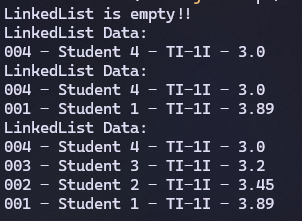
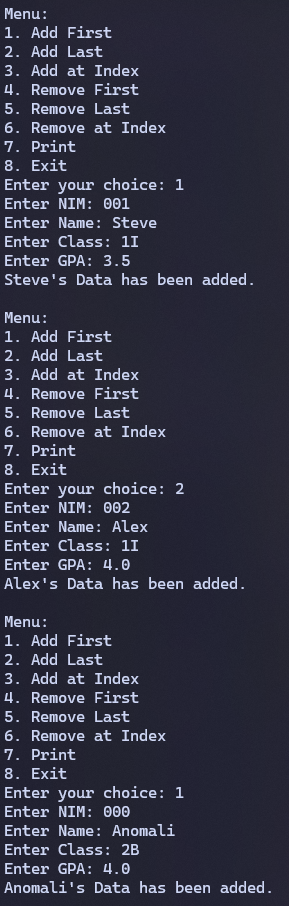
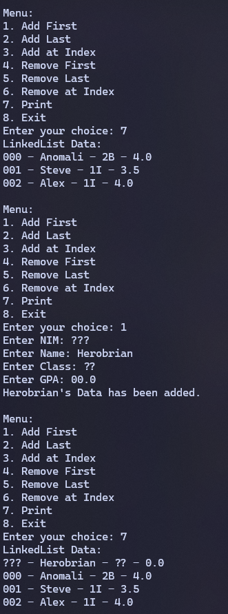
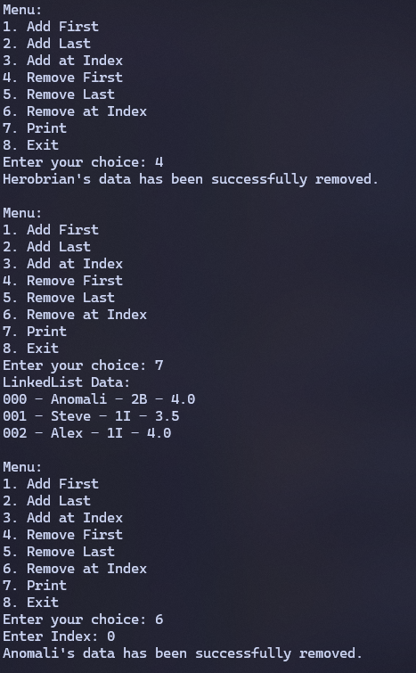
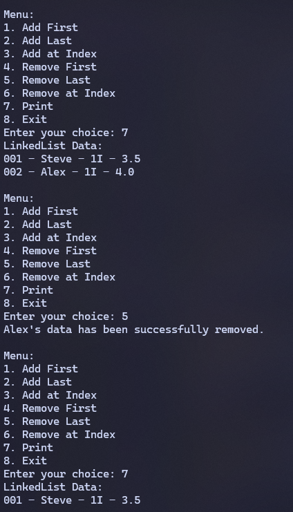
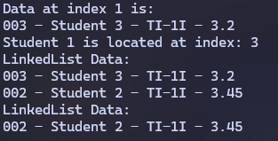
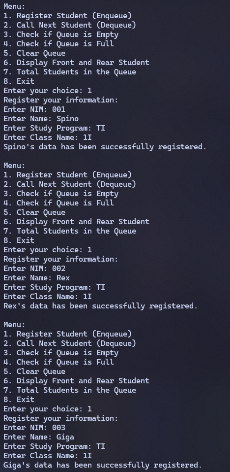
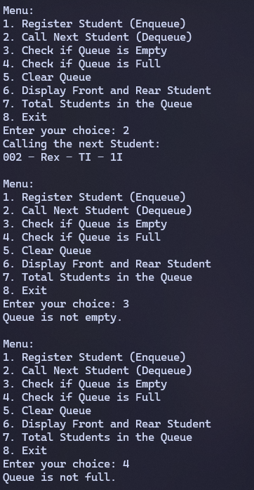
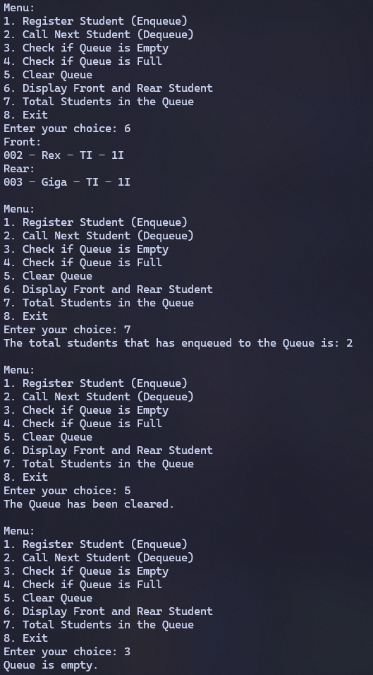

|  | Algorithm and Data Structure |
|--|--|
| NIM |  244107020215|
| Nama |  Herconary Angga |
| Kelas | TI - 1I |
| Repository | [link] (https://github.com/ukakooo/2ndSemester-PraktALSD) |

# Labs #12 Linked List

## 2.1 Implementing Single Linked List

The solution is implemented in `Exp1` folder, and below is screenshot of the result.



**Brief explanaton:** There are 4 main step: 
1. Create a student class to manage student's data
2. Create a node class
3. Create a Single Linked List class to manage the linked list attributes and methods
4. Create a main method to implement the Linked List
5. In the main method, declare the linked list class from the SingleLinkedList16.java file
6. Input students's data
7. Print the whole Linked List data
8. Add Student 4's data to the head of the linked list
9. Print the whole Linked List data
10. Add Student 1's data to the tail position of the linked list
11. Print the whole Linked List data
12. Insert Student 3's data after Student 4's
13. Insert Student 2's data in the 2nd index
14. Print the whole Linked List data

**Questions:**
1. Why does compiling the program code result in the message "Linked List is Empty" on the first line?

    Because there was no Student data that was inputted. The student object instantiation was just merely inputting Students' data onto the Student objects, not inputting the datas into the linked list

2. Explain the general purpose of the variable temp in each method!

    As a temporary variable/linked list for moving datas onto specific indexes like the implementation on sorting, navigates without modifying the head variable so the structure of the linked list is still structured

3. Modify the code so that data can be added via keyboard input!

    Implementation will be in the `SLLMain16Ques.java` file  
    
    
    
    

4. What would happen if we did not use the tail attribute? Would it affect the code implementation? Please explain.

    It will. Because tail points to the latest node. Without it, we will have to figure out to point to the latest node (before the null it is) like moving the head or loop with temp everytime to check the latest node

## 2.2. Accessing Element in Single Linked List

The solution is implemented in `Exp1` folder, and below is screenshot of the result.



**Brief explanaton:** There are 4 main step: 
1. Add new methods on the `SingleLinkedList16.java` class
2. Edit the `Main` class
3. Add students' datas
4. Print the data in the index 1
5. Search for the index of `Student 1`
6. Remove the first data on the LinkedList
7. Remove the last data on the LinkedList
8. Print the whole data
9. Remove the data at the index 0
10. Print the whole data

**Questions:**  
1. Why is the `break` keyword used in the remove function? Explain!
    
    To stop the loop if the key was found
2. Explain the purpose of the code below in the `remove(String key)` method.
    ```
    temp.next = temp.next.next;
    if (temp.next == null) {
        tail = temp;
    }
    ```
    
    - `temp.next = temp.next.next;` Bypasses the node that is about to be deleted 
    - `if (temp.next == null)` checks if we reached the last node
    - `tail = temp;` updates the tail if the condition above is true

## Assignment

**Task:**

```
Create a queue-based program for student service operations with the following requirements:

a. Implement the queue using a Linked List-based Queue.
b. The program should be a new project, not a modification of an existing example.
c. When a student wants to join the queue, they must register their information.
d. Include functions to check if the queue is empty, check if it is full, and clear the queue.
e. Implement adding a student to the queue.
f. Implement calling the next student in the queue.
g. Display the first (front) and last (rear) student in the queue.
h. Display the total number of students still in the queue.
```

The solutions are implemented on the `Assignment` folder.



