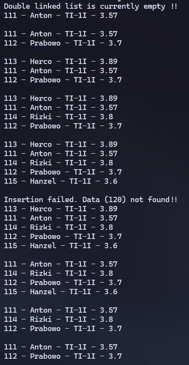

|  | Algorithm and Data Structure |
|--|--|
| NIM |  244107020215|
| Nama |  Herconary Angga |
| Kelas | TI - 1I |
| Repository | [link] (https://github.com/ukakooo/2ndSemester-PraktALSD) |

# Labs #13 Double Linked List

## 2.1. Experiment 1

The solution is implemented in Exp1 folder, and below is screenshot of the result.


**Brief explanaton:**
1. Make a `Student` class that consists of Student's data as attributes, a constructor and a print method
2. Make a `Node` class for the Linked List
3. Make a `DoubleLinkedList` class that consists of head and tail as attributes, and methods to use the Double Linked List
4. Make a `Main` class
5. Instantiate the `DoubleLinkedList` class
6. Call the `print()` method from the `DoubleLinkedList` class
7. Add Anton's data
8. Call the `print()` method again
9. Add Prabowo's data
10. Call the `print()` method again
11. Add Herco's data
12. Call the `print()` method again
13. Add Rizki's data after Anton
14. Call the `print()` method again
15. Add Hanzel's data after Prabowo
16. Call the `print()` method again
17. Attempt to add Eiyu's data
18. Call the `print()` method again

**Questions:**
1. Explain the difference between a singly linked list and a doubly linked list.  

    Double linked list can go bi-directional for the transversal method. It can go to next and previous (`next` and `prev`) to access nodes. Whilst Single linked list can only go one direction, which is forward (`next`).

2. Observe the `Node` class, which contains the attributes `next` and `prev`. What are the purposes of these attributes?

    - `next`: Used to point to the next node on the list
    - `prev`: Used to point to the previous node on the list

3. Examine the constructor in the `DoubleLinkedLists` class. What is the purpose of this constructor?   
    ```
    DoubleLinkedLists() {
        head = null;
        tail = null;
    }
    ```

    Sets the head and tail node to null at first instantiation, indicating the Linked List is empty 

4. In the `addFirst()` method, what is the meaning of the following code?  
    ```
    if (isEmpty()) {
            head = tail = newNode;
        }
    ```

5. In the `addFirst()` method, what does the statement `head.prev = newNode` mean?

    Adds the inputted New Node into the very first of the node, which is the previous of the `head` node

6. In the `insertAfter()` method, what is the meaning of `temp.next.prev = newNode`?

    Assign the node before the `temp` node with the `newNode` node 

7. In the experiment 1 code, in which method the traversal process implemented? What is the meaning of `temp = temp.next`?

    It moves `temp` to the next node

8. In the `insertAfter()` method, what is the following code for?  
    ```
    if (temp == tail) {
        addLast(data);
    }
    ```

    if the condition where `temp` points to the latest node, use the `addLast(data)` method

9. In the `insertAfter()` what is this statement `if(temp.data.nim.equalsIgnoreCase(key))` for?

    Checks if the `key` matches the `nim` data in the `temp` node

## 2.2. Experiment 2

The solution is implemented in Exp1 folder, and below is screenshot of the result.

**Brief Explanation:**
1. Modify the Main class and adding these methods
2. Call the `removeFirst()` method
3. Call the `print()` method
4. Call the `removeLast()` method
5. Call the `print()` method
6. Call the `remove()` method with an integer `1` as the parameter
7. Call the `print()` method



**Questions:**
1. What is the use of the following statement in the `removeFirst()` method?  
    ```
    head = head.next; 
    head.prev = null;
    ```

    Points the current `head` to the next Node and removes the node before the currently pointed `head`  

2. Why is it important to include conditions and processes like the ones below in both `removeFirst()` and `removeLast()` methods? Explain!
    ```
    else if(head == tail) { 
        head = tail = null; 
    }
    ```  

    Checks if the said condition is fulfilled (being `head == tail`, means there are only one data in the linked list), remove both head and tail node

3. In the `removeLast()` method, if there is no tail attribute inside `DoubleLinkedLists` class, what approach or changes need to be made to the code of the method?

    Then the method needs to make a `tmp` node and loop it until it points the last node on the list

4. What is the purpose of the initial `if(isEmpty())` check in the `remove(int index)` method?

    Checks whether the LinkedList is empty or not

5. Explain how the method handles the removal of a node at the beginning `(index == 0)` and at the end `(temp == tail)` of the linked list.

    for removal at the beginning, use `removeFirst()`:  
    - Checks if the LinkedList is empty or no (if it is, print if the LinkedList is empty)
    - Checks whether the condition `(head == tail)` is fullfilled or no. If it is, then remove both head and tail node
    - If not, points `head` into the next node. Then, remove the previous `head` (by setting it to null)

    for removal at the end, use `removeLast()`:  
    - Checks if the LinkedList is empty or no (if it is, print if the LinkedList is empty)
    - Checks whether the condition `(head == tail)` is fullfilled or no. If it is, then remove both head and tail node
    - If not, points `tail` into the previous node. Then, remove the previous `tail`'s next node (by setting it to null)

6. Describe how the method updates the links between nodes when removing a node from the middle of the linked list.

    