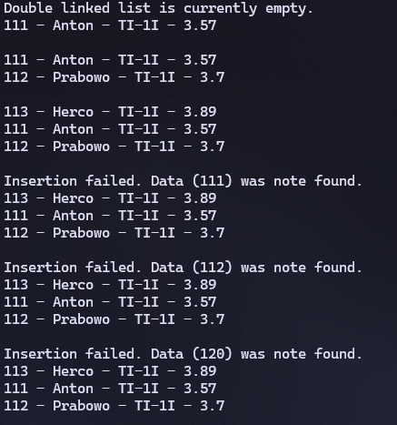

|  | Algorithm and Data Structure |
|--|--|
| NIM |  244107020215|
| Nama |  Herconary Angga |
| Kelas | TI - 1I |
| Repository | [link] (https://github.com/ukakooo/2ndSemester-PraktALSD) |

# Labs #13 Double Linked List

## 2.1. Experiment 1

The solution is implemented in Exp1 folder, and below is screenshot of the result.



**Brief explanaton:**
1. 

**Questions:**
1. Explain the difference between a singly linked list and a doubly linked list.  

    Double linked list can go bi-directional for the transversal method. It can go to next and previous (`next` and `prev`) to access nodes. Whilst Single linked list can only go one direction, which is forward (`next`).

2. Observe the `Node` class, which contains the attributes `next` and `prev`. What are the purposes of these attributes?

    - `next`: Used to point to the next node on the list
    - `prev`: Used to point to the previous node on the list

3. Examine the constructor in the `DoubleLinkedLists` class. What is the purpose of this constructor?   
    ```
    DoubleLinkedLists() {
        head = null;
        tail = null;
    }
    ```

    Sets the head and tail node to null at first instantiation, indicating the Linked List is empty 

4. In the `addFirst()` method, what is the meaning of the following code?  
    ```
    if (isEmpty()) {
            head = tail = newNode;
        }
    ```

5. In the `addFirst()` method, what does the statement `head.prev = newNode` mean?

    Adds the inputted New Node into the very first of the node, which is the previous of the `head` node

6. In the `insertAfter()` method, what is the meaning of `temp.next.prev = newNode`?

    Assign the node before the `temp` node with the `newNode` node 

7. In the experiment 1 code, in which method the traversal process implemented? What is the meaning of `temp = temp.next`?

    It moves `temp` to the next node

8. In the `insertAfter()` method, what is the following code for?  
    ```
    if (temp == tail) {
        addLast(data);
    }
    ```

    if the condition where `temp` points to the latest node, use the `addLast(data)` method

9. In the `insertAfter()` what is this statement `if(temp.data.nim.equalsIgnoreCase(key))` for?

    Checks if the `key` matches the `nim` data in the `temp` node

## 2.2. Experiment 2


