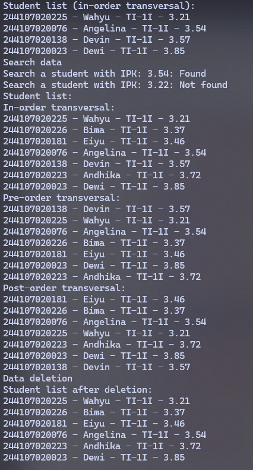
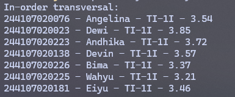
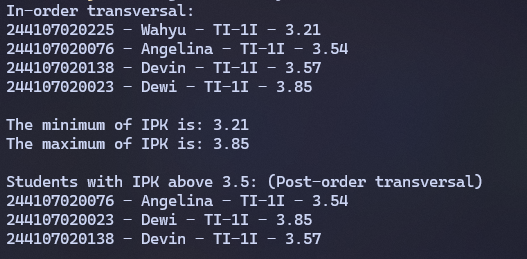
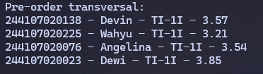

|  | Algorithm and Data Structure |
|--|--|
| NIM |  244107020215|
| Nama |  Herconary Angga |
| Kelas | TI - 1I |
| Repository | [link] (https://github.com/ukakooo/2ndSemester-PraktALSD/) |

# Labs #14 Binary Tree

## 14.1. Implementation of Binary Search Tree Using Linked List

The solution is implemented in Exp1 Folder, and below is screenshot of the result.



**Brief explanation:** 
1. Create the classes needed for the linked list such as `Node`, `Student16`, etc.
2. Create the `BinaryTree16` class for the Binary Tree to work such as making the attributes of left and right and the methods
3. Implement the methods in the main class of the `BinaryTreeMain`

**Question:**
1. Why is data search in a binary search tree more efficient compared to a regular binary tree?

    - Because it is designed specifically to overcome the weaknesses of ordinary binary tree's difficulty in searching for certain nodes by adding a condition where all left-children must be smaller than the right-child and its parent

2. What are the purposes of the left and right attributes in the Node class?

    - To represent the left and right child nodes of a parent node in a binary tree

3. a. What is the function of the root attribute in the BinaryTree class?

    - To store the root value of the tree

    b. When a BinaryTree object is first created, what is the initial value of root?

    - `null`

4. When the tree is empty and a new node is to be added, what process takes place?

    - the `public void add` method in the `BinaryTree16`

5. Consider the following line of code inside the `add()` method. Explain in detail the purpose of this line of code.

    ```
    if (data.ipk < current.data.ipk) {
        if (current.left != null) {
            current = current.left;
        } else {
            current.left = new Node16(data);
             break;
        }
    } else if (data.ipk > current.data.ipk) {
        if (current.right != null) {
            current = current.right;
         } else {
            urrent.right = new Node16(data);
            break;
        }
    }
    ```

    - First it checks if the data's IPK is bigger than the `current`'s IPK (which is root in the first instantiation).

        If it is smaller:
        - Checks whether the `current` node has a left child or no. If it has one, points the `current` node to the left child
        - If it doesn't have one, sets the `curent`'s left child with the data in the parameter

        If it is bigger:
        - Same like the smaller one but instead, it replaces the left child with the right child

6. Explain the steps involved in the `delete()` method when removing a node that has two children. How does the `getSuccessor()` method assist in this process?

    - First is getting the successor of the `current` node's in-order successor to be deleted using the `getSuccessor()` method
    - After that, replace the deleted node with the successor node depends on the node's position
        - If the node we're deleting is the root, replace the root with the successor
        - If the node is the left-child of its parent, update the deleted node by using `parent.left = successor` to keep the connection between the node's parent and the child node
        - vice versa as the step above
    
    `getSuccessor` is involved in finding the in-order successor of the node to delete `del` for the replacement, which lies in the right subtree of `del`, and the leftmost successor of that subtree 

## 14.3. Implementation of Binary Tree Using Array

The solution is implemented in Exp2 Folder, and below is screenshot of the result.



**Brief Explanation:**
1. Make a `Student16` class to store Student's data
2. Make `BinaryTreeArray16` class for the Tree to be implemented with array and fill in with declaring an array and the methods, etc.
3. Implement the Tree in the main class of `BinaryTreeArrayMain16`

**Questions:**
1. What is the purpose of the `data` and `idxLast` attributes in the BinaryTreeArray class?

    - `data`: An array for the datas of the students to be stored and implemented using Binary Tree method
    - `idxLast`: used to keep track for the populated data's last index in the array

2. What is the function of the `populateData()` method?

    - To add the existing datas into the Binary Tree

3. What is the purpose of the `traverseInOrder()` method?

    - To visit and print the values of the tree with the order of in-order transversal

4. If a binary tree node is stored at index 2 in the array, at which indices are its left and right children located, respectively?

    - Using the formula of `2 * i + 1` for left and `2 * i + 2` for the right. If the index is 2, then
        - Left child: `2 * 2 + 1 = 5`
        - Right child: `2 * 2 + 2 = 6`
    
    The left and right children are located at the 5th and 6th index respectively

5. What is the purpose of the statement `int idxLast = 6` in Experiment 2, step 4?

    - To keep track of the populated data's last index in the array, which is `data.length - 1 = 6`

6. Why are the indices `2 * idxStart + 1` and `2 * idxStart + 2` used in the recursive calls, and how do they relate to the structure of a binary tree represented as an array?

    - Those are the formula of the Array implementation of Binary Tree to determine the position of each node and to determine who's the parent or child of each node

## Assignment

1. Implement a recursive method `addRekursif()` in the `BinaryTree00` class to add nodes recursively.
2. Create methods `getMinIPK()` and `getMaxIPK()` in the `BinaryTree00` class to retrieve and display the student data with the lowest and highest `GPA(IPK)` values stored in the binary search tree.
3. Develop a method `displayStudentsWithIPKAbove (double threshold)` in the `BinaryTree00` class to display student data whose `GPA(IPK)` exceeds a specified threshold (e.g., above 3.50) within the binary search tree.
4. Modify the `BinaryTreeArray00` class by adding the following methods:
    - `add(Student data)` to insert data into the binary tree represented as an array.
    - `traversePreOrder()` to perform a pre-order traversal of the binary tree.

The implementation will be at the `Assignment` folder below the `// Assignment section` comment and for the main class, it's the whole main classes since I replaced the old one with the new implementation only


