|  | Algorithm and Data Structure |
|--|--|
| NIM |  244107020215|
| Nama |  Herconary Angga |
| Kelas | TI - 1I |
| Repository | [link] (https://github.com/ukakooo/2ndSemester-PraktALSD) |

# Labs #1 Object

## 2.1. Declare Classes, Attributes and Methods

The solution is implemented in Student16.java, and below is screenshot of the result.

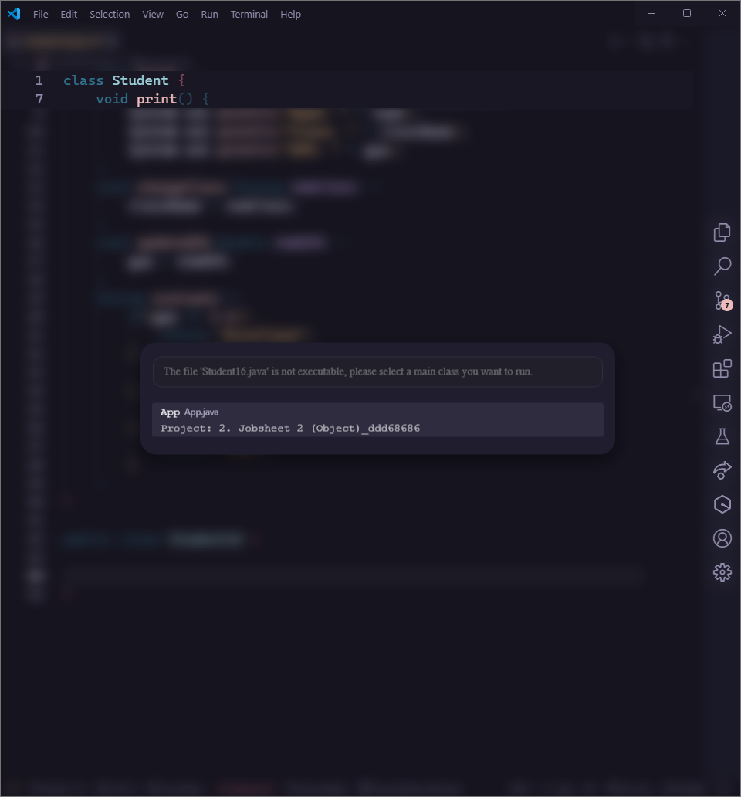

**Brief explanaton:** There are 5 main step: 
1. Declare the variables for the student's data
2. Make a method to print Student's data
3. Make a method to change Student's class
4. Make a method to update Student's GPA
5. Make a method to evaluate Student's GPA

**Questions:**
1. Is declared outside the main class, may contain attributes or methods
2. There are 4 attributes, namely:
    - Student's ID
    - Student's Name
    - Student's Class Name
    - Student's GPA
3. There are 4 methods, namely:
    - Print method
    - Change Student's Class method
    - Update Student's GPA method
    - Evaluate Student's Qualification Method
4. 
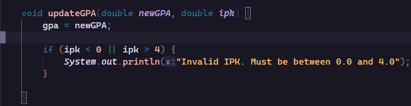

5. When the GPA reaches certain condition, it will return a String that contains Student's qualification based on that GPA condition

## 2.2. Object Instatiation and Acessing Attributes and Methods

The solution is implemented in StudentMain.java, and below is screenshot of the result.

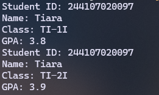

**Brief explanaton:** There are 9 main step: 
1. Insstantiate student1 object from the Student class
2. Input the Student's Student ID
3. Input student's name
4. Input student's class name
5. Input student's GPA
6. Call the print method
7. Call the changeClass method
8. Call the updateGPA method
9. Call the print method again after changing some of the student's data

**Questions**
1. Student16 student1 = new Student16();
The name is student1
2. do an instantiation like number 1 if the variables are not declared as a static
3. Because after the first print method, the code proceeds to make changes to the student's data and then prints the changed data

## 2.3. Creating a Constructor

The solution is implemented in StudentMain.java, and below is screenshot of the result.

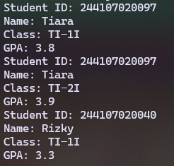

**Brief explanaton:** There are 5 main step: 
1. Declare two constructors. The one's default and the one's parameterized
2. Match the parameters with the objects on the class
3. Create another object named student2 using the parameterized constructor
4. Update the gpa and then call the print method

**Questions**
1. Student16 student2 = new Student16("244107020040", "Rizky", "TI-1I", 3.5);
2. Create new object with the parameterized constructor
3. 
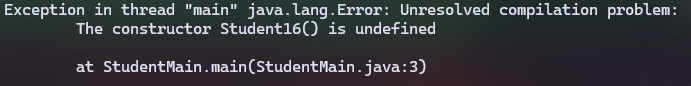

The default constructor is missing. Therefore, the 1st constructor cannot be run because Java did not generate the default constructor since we put another constructor (parameterized) manually.
4. No. You can call one of them directly without doing them by order. Because basically it's like functions. We can access each of either attribute or method anytime, as long as the object is created.

5. Here are the created objects using the parameter constructor.

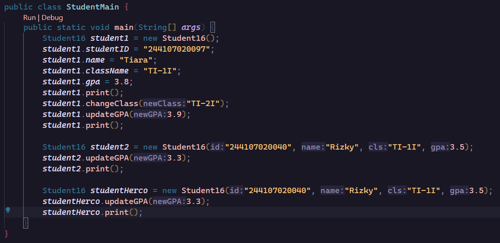
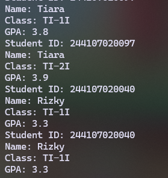

## 2.4. Assignment 1

The solution is implemented in Course16.java and CourseMain16, and below is screenshot of the result.

**Class Code**

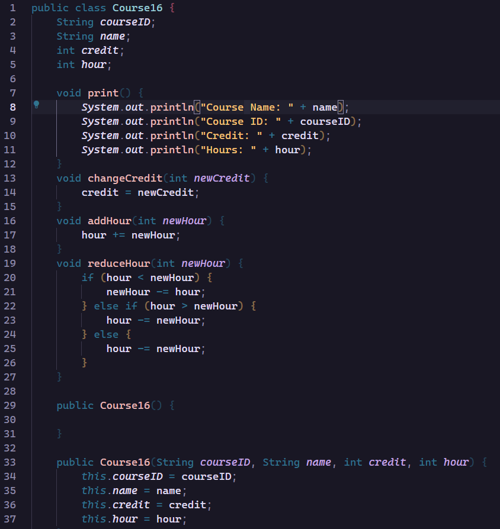;

**Main Code**

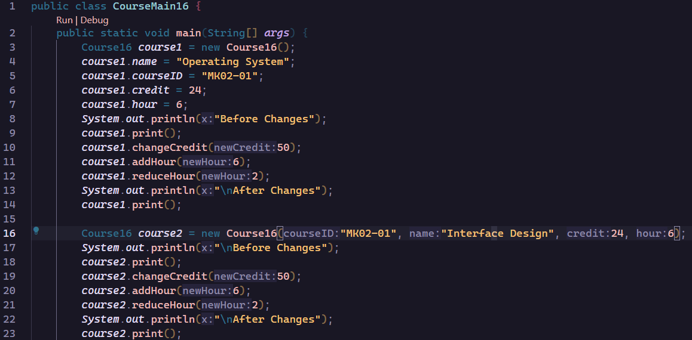;

**Output**

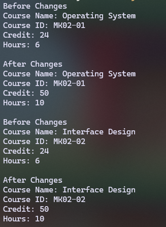;

## 2.4. Assignment 2

The solution is implemented in Course16.java and CourseMain16, and below is screenshot of the result.

**Class Code**

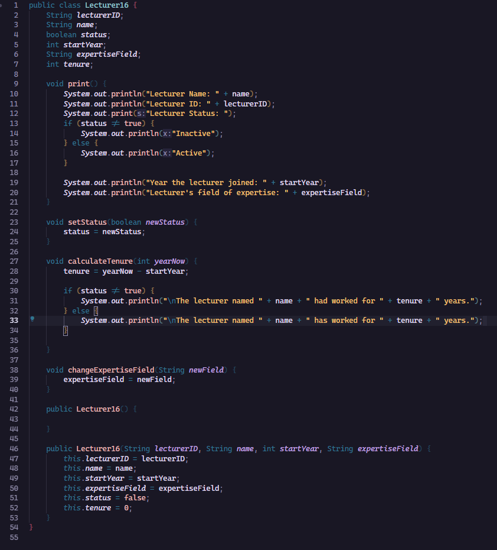;

**Main Code**

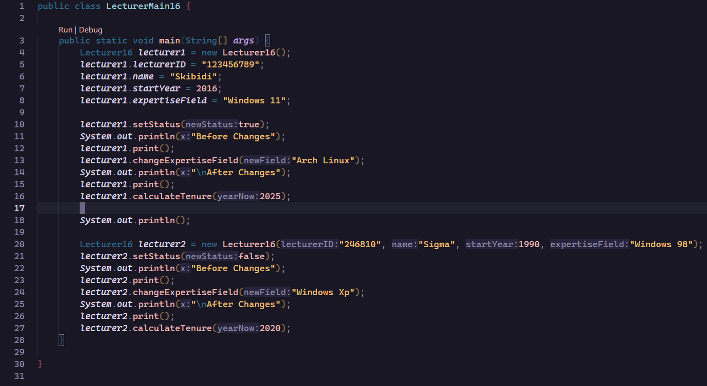;

**Output**

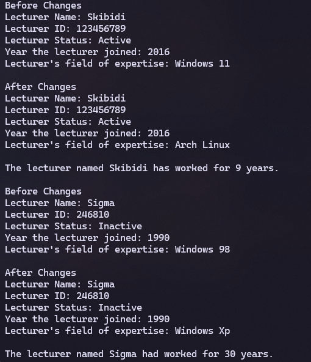;