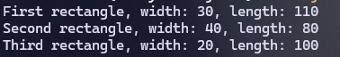
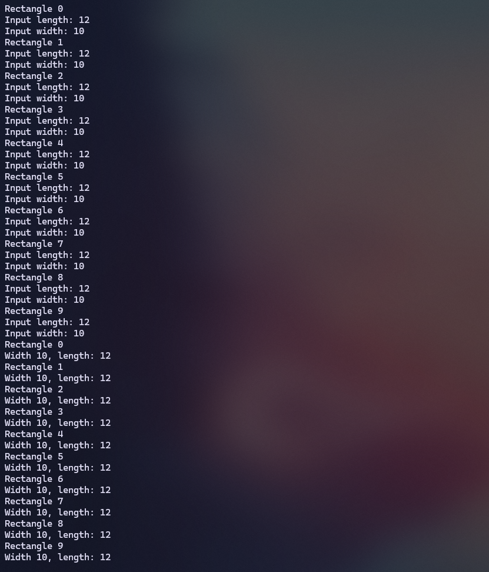

|  | Algorithm and Data Structure |
|--|--|
| NIM |  244107020215|
| Nama |  Herconary Angga |
| Kelas | TI - 1I |
| Repository | [link] (https://github.com/ukakooo/2ndSemester-PraktALSD) |

# Labs #1 Array of Objects

## 1.2 Create, insert, and display Array of Object

The solution is implemented in Rectangle.java & ArrayoOfObject.java, and below is screenshot of the result.

**Brief explanaton:** There are 4 main step: 

*Rectangle.java:*
1. Declare the two variables for width and height as an integer.

*ArrayOfObject.java*
1. Create an array of the Rectangle Class
2. Insert values of each Array's attributes.
3. Print the whole value in the array

**Questions:**
1. No. Because the class did not have any method, but just an attribute.
2. No. It is to instansiate each object in the array.
3. Declaring an array of the Rectangle object.
4. Instantsiate the Rectangle object and input the width and length variable.
5. No. We can just move the main method in the ArrayOfObject.java to the Rectangle.java

## 1.3 Input Data Into Array Object Using Loops

The solution is implemented in ArrayOfObjects.java, and below is the screenshot of the result.

**Brief explanationn:** There are 4 main step:

