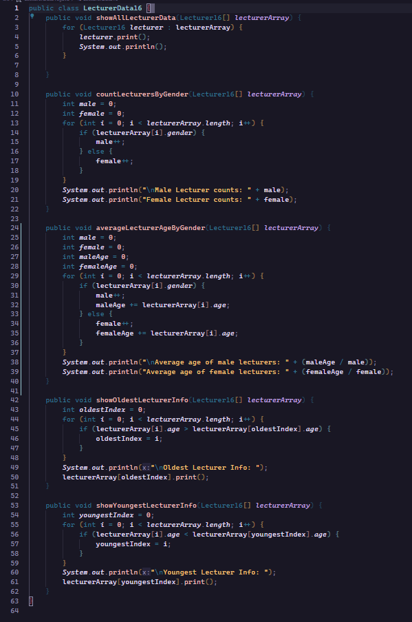
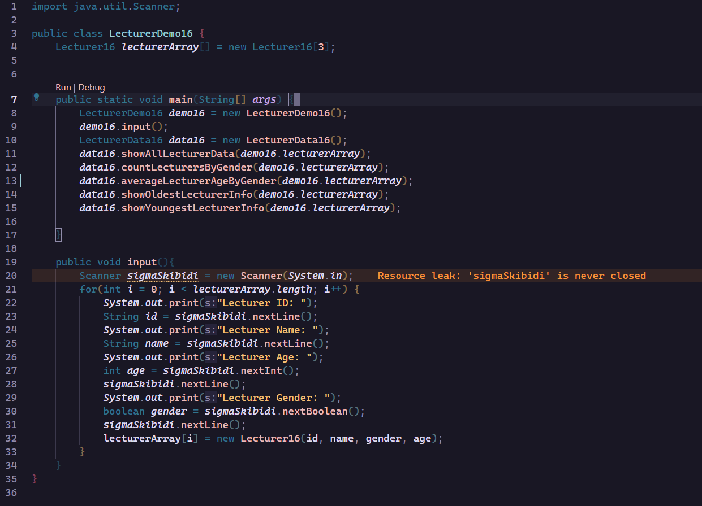

|  | Algorithm and Data Structure |
|--|--|
| NIM |  244107020215|
| Nama |  Herconary Angga |
| Kelas | TI - 1I |
| Repository | [link] (https://github.com/ukakooo/2ndSemester-PraktALSD) |

# Labs #1 Array of Objects

## 1.2 Create, insert, and display Array of Object

The solution is implemented in Rectangle.java & ArrayoOfObject.java, and below is screenshot of the result.

**Brief explanaton:** There are 4 main step: 

*Rectangle.java:*
1. Declare the two variables for width and height as an integer.

*ArrayOfObject.java*
1. Create an array of the Rectangle Class
2. Insert values of each Array's attributes.
3. Print the whole value in the array

**Questions:**
1. No. Because the class did not have any method, but just an attribute.
2. No. It is to instansiate each object in the array.
3. Declaring an array of the Rectangle object.
4. Instantsiate the Rectangle object and input the width and length variable.
5. No. We can just move the main method in the ArrayOfObject.java to the Rectangle.java

## 1.3 Input Data Into Array Object Using Loops

The solution is implemented in ArrayOfObjects.java (difference is that this one has an s in the file name now. (ArrayOfObject**s**)), and below is the screenshot of the result.

**Brief explanationn:** There are 4 main step:

1. Declare an array for the rectangle object
2. Loop a length and width input process to input a value for each array
3. Loop a print each rectangle's width and length process

**Questions:**
1. Yes it can
2. The row of the array can be the width of the rectangle and the the column can be the length of the rectangle
3. Because the squareArray object is not yet instantiated, yet we immediately input a value into the array
4. 

5. The previous values for the object will be lost and replaced with the latest instantiated object

## 1.4 Mathematical operation in array of object's attribute

The solution is implemented in ArrayBlocks.java & Blocks.java and below is the screenshot of the result.

**Brief explanationn:** There are 4 main step:

1. Declare Blocks Array
2. Input and instansiate every object and its values for each array
3. Prints out the Volume of the blocks by using the function in the Blocks class

**Questions:**
1. Yes. We can put both default constructor and parameterized constructor

2-5. 

## 1.3 Input Data Into Array Object Using Loops

The solution is implemented in ArrayOfObjects.java (difference is that this one has an s in the file name now. (ArrayOfObject**s**)), and below is the screenshot of the result.

**Brief explanationn:** There are 4 main step:

1. Declare an array for the rectangle object
2. Loop a length and width input process to input a value for each array
3. Loop a print each rectangle's width and length process

**Questions:**
1. Yes it can
2. The row of the array can be the width of the rectangle and the the column can be the length of the rectangle
3. Because the squareArray object is not yet instantiated, yet we immediately input a value into the array
4. 

5. The previous values for the object will be lost and replaced with the latest instantiated object

## 1.5 Assignment

The solution is implemented in Lecturer16.java, LecturerData16.java & LecturerDemo16.java and below is the screenshot of the result.

