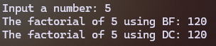
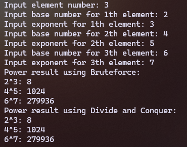
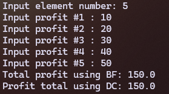
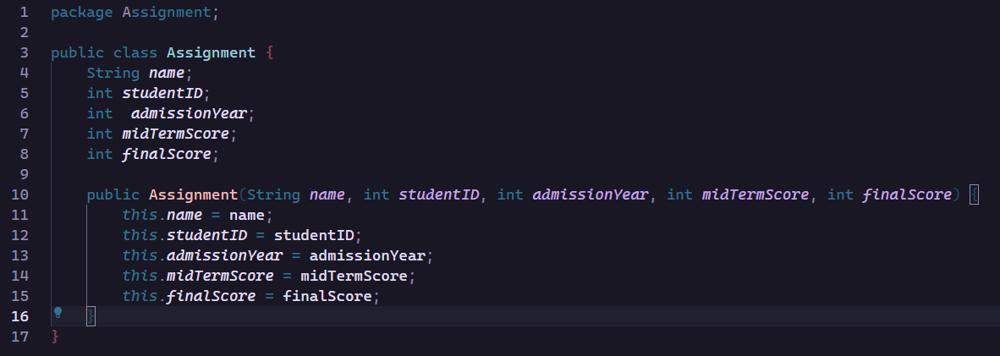
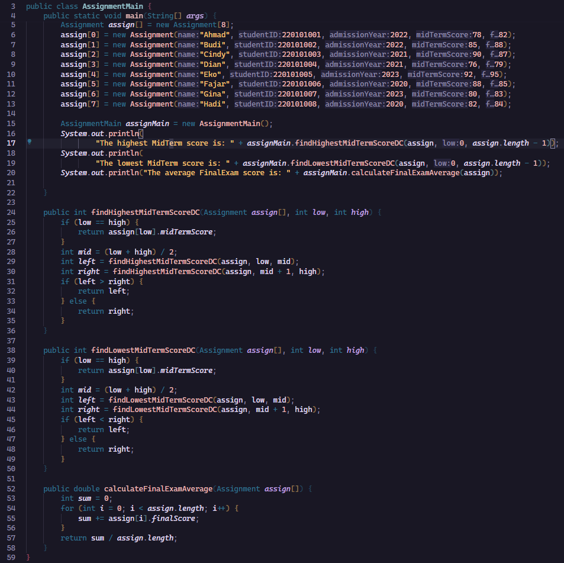
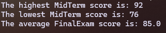

|  | Algorithm and Data Structure |
|--|--|
| NIM |  244107020215|
| Nama |  Herconary Angga |
| Kelas | TI - 1I |
| Repository | [link] (https://github.com/ukakooo/2ndSemester-PraktALSD) |

# Labs #5 Brute Force & Divide and Conquer

## 5.2.1. Calculating Factorial Using Brute Force and Divide & Conquer

The solution is implemented in Faktorial.java and MainFaktorial.java, and below is screenshot of the result.



**Brief explanaton:** There are 4 main step: 
1. Input a number
2. Do the factorial with the Brute Force Method
3. Do the factorial with the Divide and Conquer Method
4. Print the results

**Questions:**
1. If statement is for the base case or to stop the recursive, whilst the else step is the recursive function
2. Yes. Change the condition into for(int i = n; i >= 1; i--)
3. - facto = facto * i: Multiply the current number in the facto variable with the current loop index and also save it into - the facto variable 
    - int facto = n * factorialDC(n-1): Compute the said syntax until the n reaches 1

4. Both works the same, but with a different approach. Brute Force uses iteration and increment, whilst Divide and Conquer uses recursion approach and a decrement approach.

## 5.3.1. Calculating Exponentiation Using Brute Force and Divide and Conquer Algorithms
The solution is implemented in Power.java and PowerMain.java, and below is screenshot of the result.



**Brief explanaton:** There are 3 main step: 
1. Input a base and an exponent number
2. Calculate the power using brute force and print the result
3. Calculate the power using Divide and Conquer and then print the result

**Questions:**
1. - PowerBF: calculates by multiplying the numbeers with the amount of n times
    - PowerDC: uses recursive method and divides the exponent in half
2. Yes, there is a combine stage in the method. The combine stage is in the recursive method, depends the on the value of e is odd or even
3. No, because recursive methods needs parameteres to pass on.
4. - PowerBF(): calculates the power using a loop. The process will be slower if the exponent size is large
    - PowerDC(): calculates the power using recursive. Faster but uses a lot of memory because it uses the recursive method

## 5.4.1. Calculating Array Sum Using Brute Force and Divide and Conquer Algorithms
The solution is implemented in Sum.java and SumMain.java, and below is screenshot of the result.



**Brief explanaton:** There are 4 main step: 
1. Input Element Number
2. Use a loop to input profit
3. Calculate the profit's sum using Brute Force method and prints the result
4. Calculate the profit's sum using Divide and Conquer method and prints the result

**Questions:**
1. Because it is used as an index to divide the profits
2. - 1st Statement: Calculates the first half of the profits using a recursive
    - 2nd Statement: Calculates the second half of the profits using a recursive
3. Because it combines the two halves of the array since totalDC divides the array into two.
4. 
```
if (l == r) {
            return arr[l];
        }
```
5. totalDC() uses a recursive method to calculate the sum of the profits. Before calculating the sum, the method divides in into two and calculate each halves of the profits. After that, the method combines the two halves of the profits, resulting the result of the array's sum.

## 5.5. Assignment
The solution is implemented in Assignment.java and AssignmentMain.java, and below is screenshot of the result.



