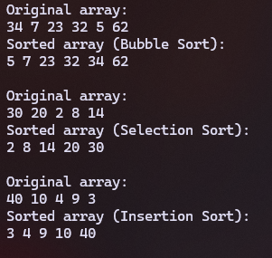
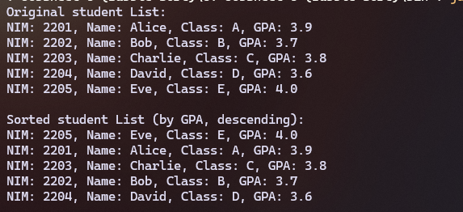
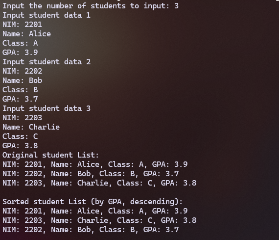
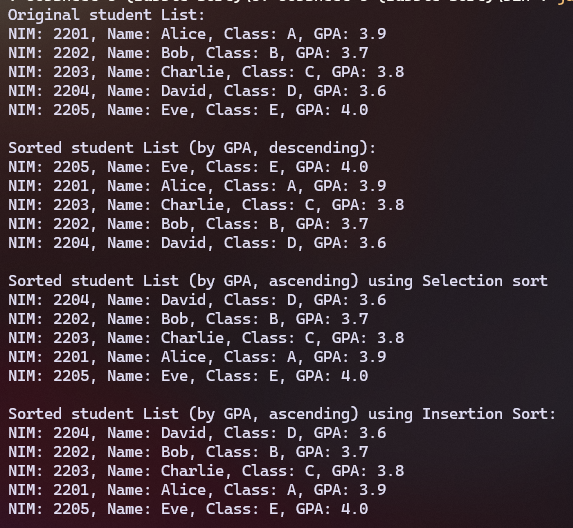
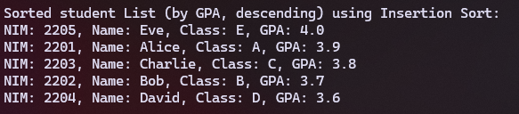
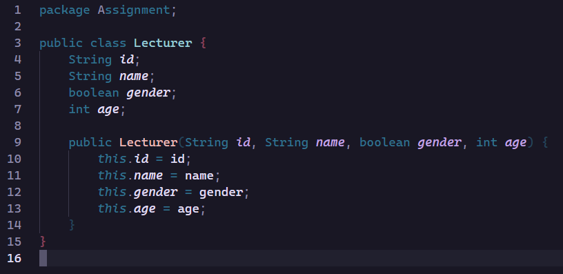
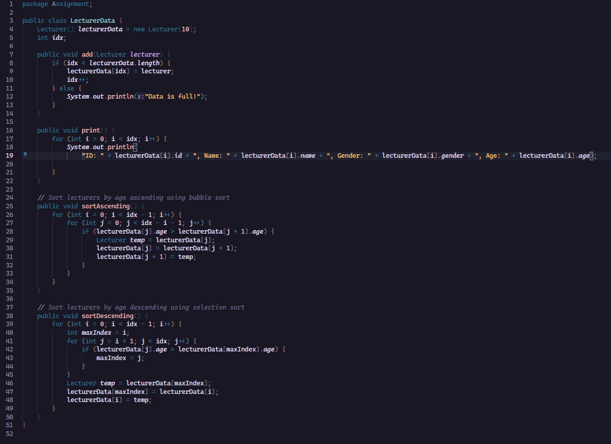
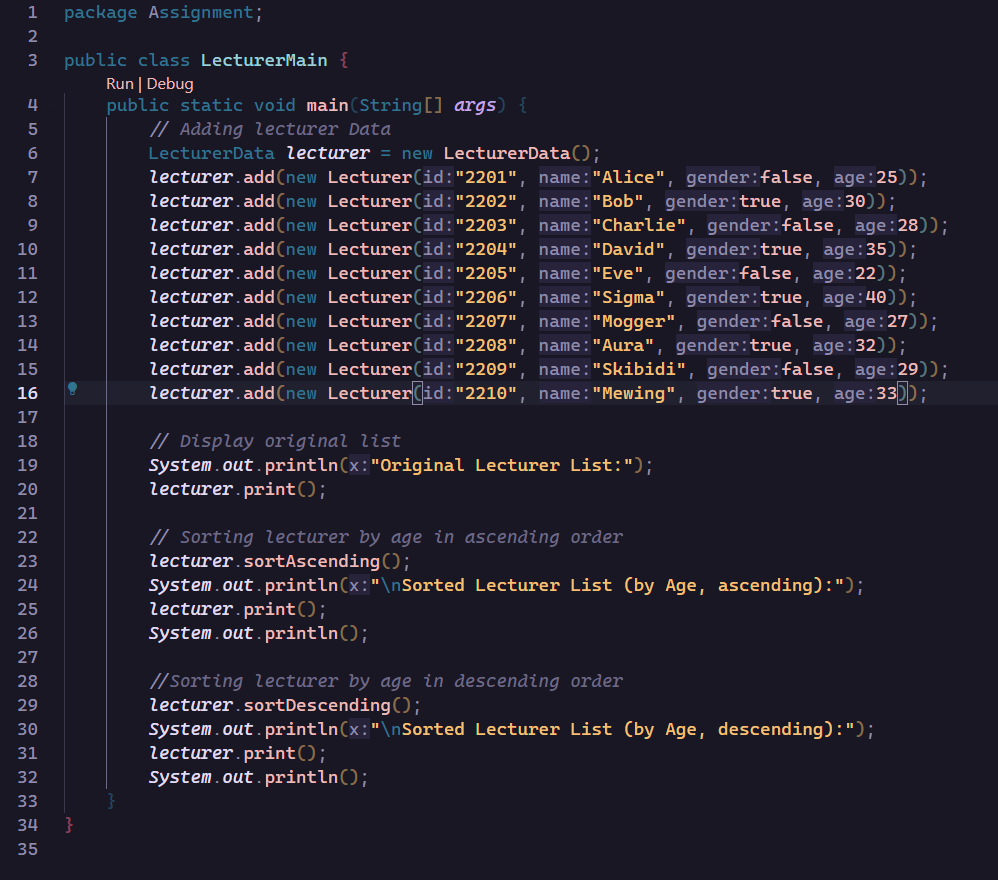
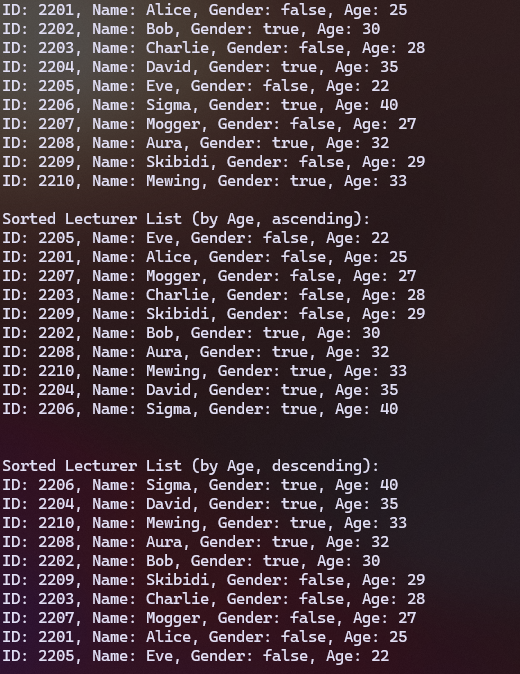

|  | Algorithm and Data Structure |
|--|--|
| NIM |  244107020215|
| Nama |  Herconary Angga |
| Kelas | TI - 1I |
| Repository | [link] (https://github.com/ukakooo/2ndSemester-PraktALSD) |

# Labs #6 Sorting (Bubble, Selection and Insertion)

## 6.2 Implementing Sorting Using Objects

The solution is implemented in Sorting16.java and SortingMain16.java, and below is screenshot of the result.



**Questions**:
1.  If data[j] is greater than the next element, which is data[j+1], then:
    - Assign the current data[j] value into a temp variable for a temporary value assign
    - Move the value of data[j+1] into the data[j]
    - Assign the data[j+1] variable with the temp value we assigned earlier  
In conclusion, the syntax swaps the values of two variables if the condition is met
2. ```
    for (int i = 0; i < size - 1; i++) {
            int minIndex = i;
            for (int j = i + 1; j < size; j++) {
                if (data[j] < data[minIndex]) {
                    minIndex = j;
                }
            }
            int temp = data[minIndex];
            data[minIndex] = data[i];
            data[i] = temp;
        }
    ```
3. Moves the value that are greater than `key` varuable one position to the right
4. The function of that syntax is to switch the value on the index of `j + 1` into the index of `j`

## 6.3.2 Sorting Using an Array of Objects

The solution is implemented in Students16.java, TopStudents16.java and StudentDemo16.java, and below is screenshot of the result.



**Questions**:
1. a. So the loop only run the necessary number of passes  
    b. so that the loop only compare unsorted elements
    c. 49
2. 

## 6.3.2 Sorting Using an Array of Objects

The solution is implemented in Students16.java, TopStudents16.java and StudentDemo16.java, and below is screenshot of the result.



**Questions**:
1. 

## Assignment



