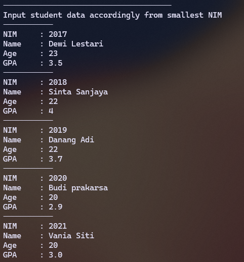
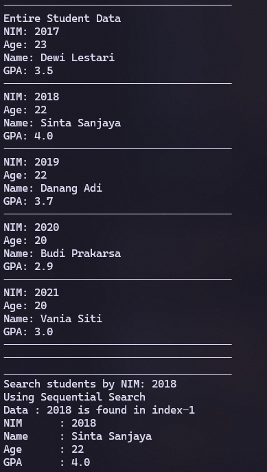
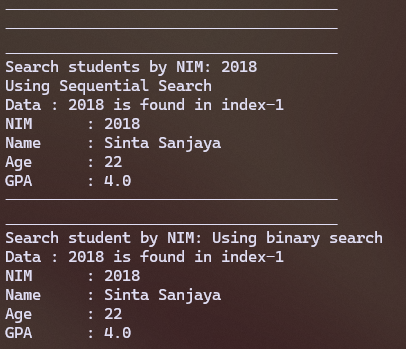
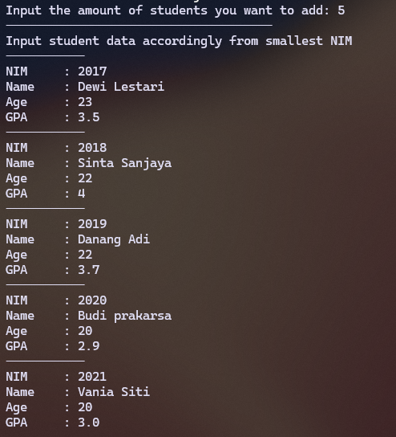
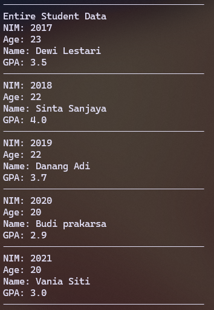
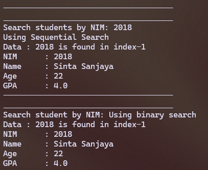
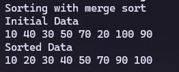
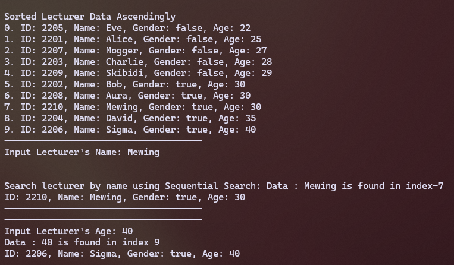
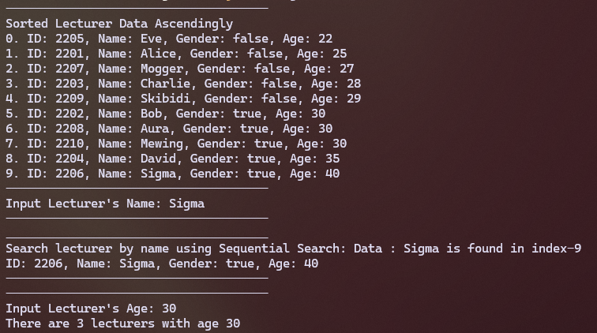

|  | Algorithm and Data Structure |
|--|--|
| NIM |  244107020215|
| Nama |  Herconary Angga |
| Kelas | TI - 1I |
| Repository | [link] (https://github.com/ukakooo/2ndSemester-PraktALSD) |

# Labs #7 Searching

## 7.2. Sequential Search

The solution is implemented in Students.java, SearchStudents.java, and MainStudent.java, and below is screenshot of the result.




**Brief explanaton:** There are 5 main step: 
1. Input the students' datas 5 times
2. Display the entire data
3. Input the NIM we want to search
4. Search using Sequential Search
5. Display the searched student's data and position (index)

**Question**
1. - displayData: displays the data of the student based on the index that was saved in the code
    - displayPosition: displays only the index of the found data based on NIM
2. It is to assign the found data's index to the position variable for the displayData() function
3. I don't think so. Because sorted or no, the program will still find the data according to NIM until it's found anyways
4. Because for a condition if the data is not found. If it's inputted 0, the program will recognize it as the data is found in the index of 0

## 7.3. Binary Search

The solution is implemented in Students.java, SearchStudents.java, and MainStudent.java, and below is screenshot of the result.




**Brief explanaton:** There are 5 main step: 
1. Input the students' datas 5 times
2. Display the entire data
3. Input the NIM we want to search
4. Search using Binary Search
5. Display the searched student's data and position (index)

**Question**
1. ``mid = (left + right) / 2``
2. 
```
if (cari == listStd[mid].nim) {  
                return (mid);  
            } else if (listStd[mid].nim > cari) {  
                return FindBinarySearch(cari, left, mid - 1);  
            } else {  
                return FindBinarySearch(cari, mid + 1, right);  
            }
```
3. No, it will not. Because the program checks if the cari value is bigger than the mid or no to decide whether to go to the left/right side of the data lists for the next iteration. Therefore, the program must be sorted in the ascending order. 

If the data lists are sorted in the descending order, it will return not found because the program expects that the data lists are sorted in the ascending order. Therefore we have to change the program's logic  
```
public int FindBinarySearchDescending(int cari, int left, int right) {
        int mid;
        if (right >= left) {
            mid = (left + right) / 2;
            if (cari == listStd[mid].nim) {
                return (mid);
            } else if (listStd[mid].nim < cari) {   // flip this so that when this condition is met, it will go to  the left side instead of the right side
                return FindBinarySearch(cari, left, mid - 1);
            } else {
                return FindBinarySearch(cari, mid + 1, right);
            }
        }
        return -1;
    }
```
4. As for the program codes, they can be seen in the Exp1Scanner folder because there are not much room to screenshot.  




## 7.4. Divide and Conquer Review (Merge Sort)

The solution is implemented in MergeSort.java & SortMain.java, and below is screenshot of the result.



**Brief explanaton:** There are 2 main step: 
1. Input Array Numbers
2. Use Merge Sort to sort the arrays

## Assignment

For the Program Code, it can be seen in the assignment folder. I will only show the output because the code is too long to screenshot so it might be best to look at the file itself.

- Program without duplicates  
  

- Program with duplicates  
